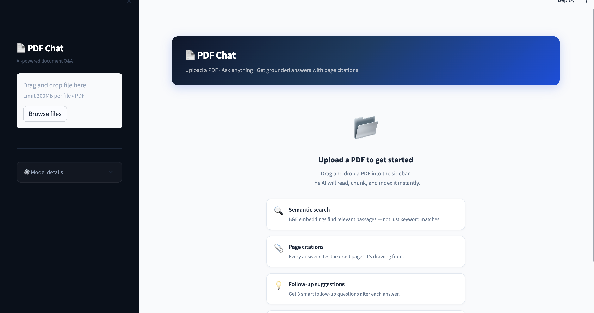

# PDF Chat — RAG Q&A App

A Streamlit app that lets you upload any PDF and chat with it using Retrieval-Augmented Generation (RAG).

---

## Demo



---

## Prompt Logs

AI assistant (Claude Code) was used throughout development. Conversation screenshots are in [`prompt_logs/`](prompt_logs/) covering:
- Initial architecture planning
- Debugging Streamlit session state and ChromaDB issues
- Building the eval script and model comparison

---

## Setup

### 1. Clone & install

```bash
git clone https://github.com/Sidhi2001/manpower_assignment
cd manpower_assignment_sidhi
pip install -r requirements.txt
```

### 2. Set environment variables

```bash
cp .env.example .env
# Paste your Groq API key — free, no credit card, takes 30 seconds
# Get one at: https://console.groq.com/keys
GROQ_API_KEY=gsk_...
```

### 3. Run

```bash
streamlit run app.py
```

---

## Architecture

### Models

| Component | Model | Dimensions | Hosted |
|-----------|-------|------------|--------|
| Embeddings | `BAAI/bge-base-en-v1.5` | 768 | Local (sentence-transformers) |
| LLM | `llama-3.3-70b-versatile` (configurable via `LLM_MODEL` in `.env`) | — | Groq free tier |

### Chunking Strategy

- **Library:** PyMuPDF (`fitz`) for text extraction
- **Method:** Character-based sliding window, **page-local**
  - Chunk size: **800 characters**
  - Overlap: **100 characters**
  - Chunks stay within their source page so page citations are always accurate
- **Why:** Character-based chunking is model-agnostic and the fixed overlap prevents context loss at boundaries. Keeping chunks page-local (rather than splitting across pages) makes citations trivially correct — each chunk knows exactly which page it came from.

### Vector Store

**ChromaDB** with cosine similarity, persisted to `./storage/`.

- Zero-config local persistence, native Python, no server needed.
- A fresh collection is created on each PDF upload to avoid stale data.
- Embeddings are computed locally via `sentence-transformers` — no API calls, no rate limits.

### Retrieval Strategy

**Top-5 cosine similarity search** with BGE query prefix.

- BGE models achieve best retrieval when queries are prefixed with `"Represent this sentence for searching relevant passages: "` — applied automatically before querying.
- Top-5 results are deduplicated by page number (best-scoring chunk per page wins) before being shown as citations.
- Simple similarity search is fast and sufficient for single-document Q&A. MMR would reduce redundancy on very long docs but adds latency.

### Conversation History

- The last **6 messages** (3 user + 3 assistant turns) are injected into the LLM prompt before the context-augmented user message.
- This lets the model resolve follow-up references ("What about the second point?") without re-explaining context.
- History is stored in `st.session_state.messages` and **persisted to `./storage/conv_<hash>.json`** — re-uploading the same PDF reloads the previous conversation automatically.

---

## Project Structure

```
.
├── app.py                  # Streamlit UI entry point
├── modules/
│   ├── pdf_processor.py    # PDF extraction + chunking
│   ├── vector_store.py     # ChromaDB + local BGE embeddings
│   └── rag_pipeline.py     # Retrieval + Groq LLM generation
├── eval/
│   └── evaluate.py         # CLI eval script (bonus)
├── storage/                # ChromaDB + conversation persistence
├── .streamlit/
│   └── config.toml         # Theme configuration
├── requirements.txt
├── .env.example
└── README.md
```

---

## Evaluation 

Ran 9 technical questions against **Attention Is All You Need** using a custom eval script (`eval/evaluate.py`). Questions cover factual recall, conceptual understanding, and follow-up reasoning. Each answer is auto-scored using keyword overlap against an expected answer (0 = wrong, 1 = partial, 2 = correct). Results saved to CSV.

Tested two models to compare answer quality:

| Model | Avg Score | % Correct | Fully Correct | Partial | Wrong |
|-------|-----------|-----------|---------------|---------|-------|
| `llama-3.1-8b-instant` | 1.67 / 2 | 83% | 7 | 1 | 1 |
| `llama-3.3-70b-versatile` | **1.78 / 2** | **89%** | 7 | 2 | **0** |

The 70B model produced zero wrong answers and handled follow-up and conceptual questions better. The app uses `llama-3.3-70b-versatile` by default. Model is configurable via `LLM_MODEL` in `.env`.

---

## Known Limitations

- **Scanned PDFs / images:** PyMuPDF extracts digital text only; image-only pages return empty and are skipped. Use a PDF with selectable text.
- **Single PDF at a time:** The vector store is reset on each upload. Multi-PDF support would require per-document namespacing in ChromaDB.
- **No re-ranking:** Chunks are returned by cosine similarity. A cross-encoder re-ranker would improve precision on ambiguous queries.
- **First-run model download:** `BAAI/bge-base-en-v1.5` (~440 MB) downloads once on first use and is cached at `~/.cache/huggingface/`.
- **Groq rate limits:** Free tier allows ~14,400 requests/day. Sustained heavy use may hit limits.
